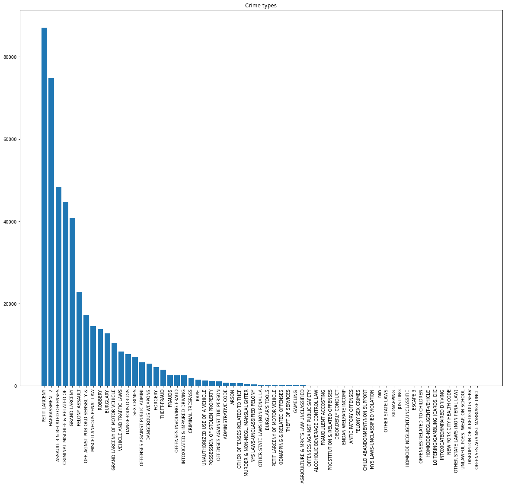
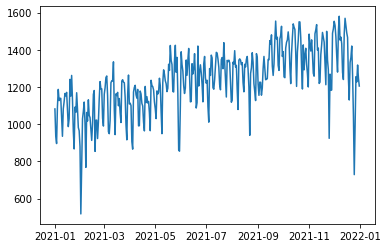
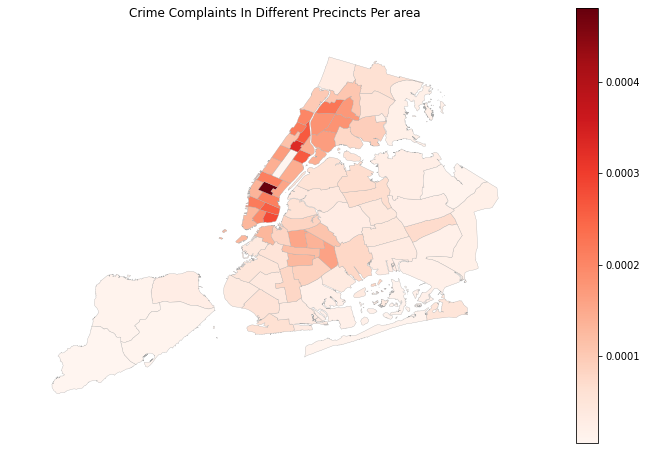
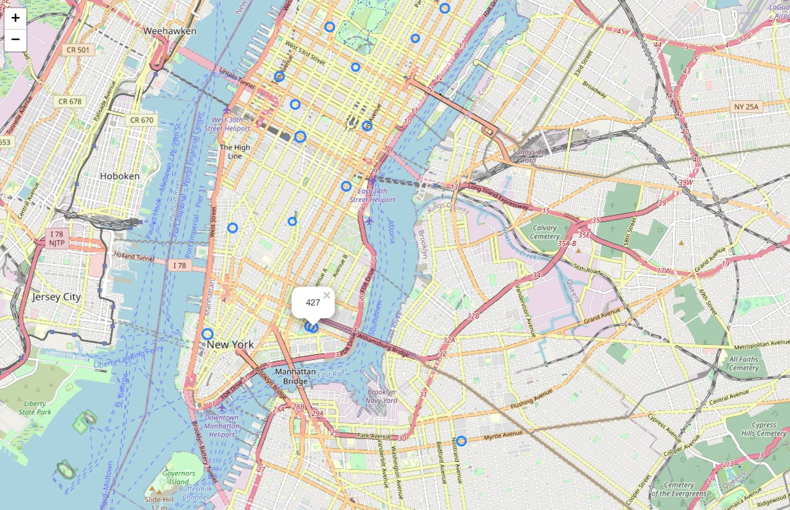

# New York Crime Analysis

**Crime Analysis and Prediction of NYPD Complaint Dataset**

Chenran Ning(cn257), Yiyun Wang(yw576), Scarlett Huang (sh2557), Yuntian Ye(yy483)

This is a course project for CS/INFO 5304 Data Science in the Wild (2022SP) at Cornell Tech.

I implemented the Crime_Prediction.ipynb in Google Colab, leveraged python to build multiple machine learning models analyze preprocessed dataset.

## **Abstract**

The crime rate in NYC increases yearly. With the limited available jurisdiction officers, It is crucial to develop a model to predict the areas with high potential crime occurrence with a better patrol. Our data analysis aims to solve the problem of how to better allocate the funding to prevent crime and complaints. In this preliminary data analysis, we finished data cleaning of the NYPD Complaint Data and also visualized some of the key metrics. We found out that the number of complaints received persists on an upward trend. Also, we were able to analyze the specific features of each complaint. Our future work includes building out machine learning models to fit and predict future complaints. 

## **Background**

As the crime rate increases in New York City, the problem of how to better allocate the limited government fund to improve city patrol arises. Our project aims to solve the problem of better allocation of state/ federal funds for the installation of surveillance cameras and police patrol arrangements based on the prediction of areas with a potential high crime incidence rate to prevent future crimes. 

Our data is the NYC historical complaint data from 1921 to 2021. We are going to separate our data analysis process into three steps. First, we are going to clean the data to have unified formats for better future analysis and also exclude data with large portions of missing data. Next, we are going to conduct crime analysis using data analysis and visualization techniques to identify crime trends and patterns, e.g. demographic distributions of suspects and victims, spatial and temporal distributions of crime cases, etc. Finally, we are going to use ML Classification algorithms, including Naive Bayes, Linear Regression, Decision Tree and Random Forest Classification, to predict future crimes (predict top features that affect high crime rates or high crime severity); then compare their performance. 

## **Data set**

The dataset we are using is the [NYPD Complaint Data Current (Year To Date)](https://data.cityofnewyork.us/Public-Safety/NYPD-Complaint-Data-Current-Year-To-Date-/5uac-w243), which is an open dataset from the NYC OpenData Website. The dataset contains the New York City historical crime complaint data from year 1921 to year 2021. The size is about 175 MB (449506 rows × 36 columns). The dataset includes 36 various features of crime complaints, suspects and victims, such as the time and locations of crimes, the types and severity of crimes, and the demographic characteristics (e.g. age, race, gender) of victims and suspects. 

This dataset is adequate for our analysis because of the richness of meaningful features, completeness of labels, sufficiency of data volume, and credibility of the data source. There's no significant bias in the dataset. The data distribution is close to the real world’s distribution, and there is adequate data in each predicted class.

## **Analysis**

**Midterm milestone: Data cleaning and feature explorations**

Our first milestone is to finish data cleaning by 4/15. For data cleaning, we dropped unimportant features like randomly generated persistent IDs which are irrelevant for our future analysis. We went through all features to evaluate their importance in our future prediction. We also visualized some of the features to present the data better. Here’s the [link](https://colab.research.google.com/drive/1Pc4S4R4HoUk4UpPRqGtLLVDQalbZRjEt?usp=sharing) to our analysis code.

In the raw data, there are several columns representing the occurrence of the event, conclusion time of the event in date and time. We combined the date and time together into a complete time. For those complaints that have both start and end times, we also included a feature called duration to count the duration of the incident to be solved. In the data, there are some columns missing including complaints having a start time but no end time or the other way, and some only have a date but not the time the complaint happened. We stored all data in a unified format for further analysis. For the date features that are in string date time format (e.g. "12/07/2021"), we performed Type Conversion on it by using *Pandas to_datetime*() method to convert them into Python Date time object (i.e. "%y-%m-%d" format). For the unnecessary features, e.g. "X_COORD_CD" and "Y_COORD_CD", the X-coordinate and Y-coordinate of crime cases, we discard them from the dataset because we have coordination data already. Above is our data cleaning work. We also did some exploratory data analysis and data visualization on the dataset, as you can see in the “Initial Results” section.

After the midterm milestone, we started to clean preprocessed data to fit our problems. 

**Problem description**

After carefully analyzing the exploratory data generalized by the raw data cleaning process, we decided to define the specific data exploring problem as follows. We want to predict the crime severity using the basic features extracted from the raw crime information. This problem is a binary classification problem that will classify crimes into serious or non-serious crimes. Serious crime is defined by the feature column “LAW_CAT_CD” which has 3 unique categories, in which felony and misdemeanor will be categorized as serious crimes and violations will be categorized as non-serious crimes. Next, we will talk about how we solve this problem by dissolving into three parts, feature encoding, dataset preparation and modeling. And we will talk about the results from different models.

## **Methods**

Here's a link to our [feature encoding](https://colab.research.google.com/drive/1Z_vL0W8DGqOPgaHZTpaIr-luzgkvLy5q?usp=sharing) codes, and [modeling](https://colab.research.google.com/drive/1VqVWbROGM4m8hM1Cqauu4TT30EWrxwrh?usp=sharing).

**Feature Encoding**

Before moving on to modeling and training the models, we firstly tried to extract valid information and features from the pre-processed dataset. We’d like to encode the features into vectors which indicate the features of each crime. We dropped unrelated data, unified data format, applied label encoder and one-hot encoder, standardized data, and filled nan by median.

Prediction value is column LAW_CAT_CD, so we drop those rows with nan values. After this, we have (449506, 33) shape of data. Then, change categorical features into numerical. For feature encoding, we used label encoding as well as one-hot encoding depending on the features with categories, and we convert number values into float or int. For label encoding, JURIS_DESC and property type are suitable; For one-hot encoding, Location of occurrence fits. Also, property type, Suspect and Victim demographic info, Complaint time, Duration and LAW_CAT_CD are converted to certain data types.

Furthermore, after encoding, we deleted those entries with less than 1000 frequencies in the group of OFNS_DESC. We fill in the median into nan values and drop original Suspect and Victim demographic info. Lastly, we normalized the ADDR_PCT_CD and PREM_TYP_DESC.

After those above features were extracted, we called this dataset “crime features”. It has the shape of (445114, 17).

**Dataset Preparation**

We labeled the entries as serious or non-serious according to the LAW_CAT_CD of the crimes. Felony and misdemeanor are mapped to 1, while violation is mapped to 0. We got 370583 ones and 74531 zeros. We split the dataset into a training dataset and a test dataset with a split rate at 0.2.

**Modeling**

Here we use 6 classification models to obtain the seriousness of the crime. 

**Decision Tree Classifier:** A decision tree is a flowchart-like structure in which each internal node represents a "test" on an attribute, each branch represents the outcome of the test, and each leaf node represents a class label. The paths from root to leaf represent classification rules.

**XGBClassifier:** stands for Extreme Gradient Boosting, is a scalable, distributed gradient-boosted decision tree. It provides parallel tree boosting and is the leading machine learning library for classification. 

**Random Forest Classifier:** an ensemble learning method for classification, regression and other tasks that operates by constructing a multitude of decision trees at training time. For classification tasks, the output of the random forest is the class selected by most trees.

**Naive Bayes Classifier:**  probabilistic classifiers based on applying Bayes' theorem with strong (naive) independence assumptions between the features.

**Logistic Regression:** the (binary) logistic model (or logit model) is a statistical model that models the probability of one event (out of two alternatives) taking place by having the log-odds (the logarithm of the odds) for the event be a linear combination of one or more independent variables ("predictors"). 

**LightGBM:** gradient boosting framework that uses tree based learning algorithms. 

## **Results**

### **Initial Results**

Some of the information we got from the dataset includes the location(geographic, premise wise) of the complaint, the type, date of the complaint, the jurisdiction department responsible for the complaint, and the level of offense. 

From the JURISDICTION_CODE column which indicates the Jurisdiction responsible for incidents, we found that the main responder is the police, including NY Police Department, NY Transit Police, and NY Housing Police. From the data, we also were able to visualize the incidence type. (Figure 1) From the figure, we could see that the most common complaint types are petit larceny, harassment, and assault. From the “report date” data, we can see that the amount of crime complaints in New York City from 01/2021 to 01/2022 shows a fluctuating upward trend, as shown in Figure 2. From the location data of the complaints, we were able to find that the order of the number of complaints from the most to the least is Brooklyn, Manhattan, Queens, Bronx, and Staten Island. Figure 3 illustrates the frequency of incidence per area. Also, the data showed that patrol borough Bronx has the highest incidence occurrence which indicates the jurisdiction departments there are under the highest workload if the officer to resident ratios between different patrol boroughs are similar. 

There is latitude and longitude data in the dataset that precisely record the locations of where the complaints happen. We use the Python Folium library which is good for geospatial analysis. We plot an interactive map (Figure 4). We calculate the number of crime complaints in each geolocation and rank them from the highest to the lowest. Then we use the CircleMarker function to mark the Top 1% places with the most crime complaints on this map, as you can see, they are marked as blue circles and when clicking the circle, the popup shows the number of crime complaints in this place.

|  |  |
| ------------------------------------------------------------ | ------------------------------------------------------------ |
| **Figure 1** The Complaint Type Sorted by Count              | **Figure 2** Plot of Report Date                             |
|  |  |
| **Figure 3** The Crime Complaints in Different Precincts per Area | **Figure 4** Interactive Map of New York City Crime Geospatial Distribution |

**Modeling Results**

As stated previously, our selected models will use 16 important features to predict the seriousness of crime, which is binary, as “felony” and “misdemeanor” is 1 and “violation” is 0. Selected model and its classification performance is demonstrated in the following table. 

| Model Name          | Accuracy | Precision | F1 Score | Top 2 Important Features |
| ------------------- | -------- | --------- | -------- | ------------------------ |
| Decision Tree       | 0.7055   | 0.7188    | 0.7120   | ADDR_PCT_CD, JURIS_DESC  |
| XGBoost             | 0.8305   | 0.6898    | 0.7536   | VIC_AGE_GROUP, Duration  |
| Random Forest       | 0.8236   | 0.7178    | 0.7533   | ADDR_PCT_CD, JURIS_DESC  |
| Naive Bayes         | 0.8266   | 0.7165    | 0.7533   | ADDR_PCT_CD, JURIS_DESC  |
| Logistic Regression | 0.8305   | 0.6898    | 0.7536   | ADDR_PCT_CD, JURIS_DESC  |
| LightGBM            | 0.8305   | 0.6898    | 0.7536   | Duration, ADDR_PCT_CD    |

### **Feature Importance**

| **Figure 1.** Decision Tree | **Figure 2.** XGBoost |
| ------------------------------------------------------------ | ------------------------------------------------------------ |
| **Figure 3.** Random Forest | **Figure 4.** Naive Bayes |
| **Figure 5.** Logistic Regression | **Figure 6.** Light GBM |

As shown above, Figure 1-6 show the feature importance in different models. And also from the table, we can see that there’s no significant difference in performance among these models, except for the decision tree. Most models point the important features towards ADDR_PCT_CD and JURIS_DESC, which represent the precinct in which the incident occurred and jurisdiction responsible for the incident. This indicates that the location is a crucial factor for the level of crime as certain seriously offensive crime only occurs in particular regions. Jurisdiction means the law enforcement department involved in the offense, for instance, the police department, housing police, and transit police. The responding law enforcement department directly reveals the seriousness of the offense, but the inner causality remains unclear as we can only see the correlation. PREM_TYP_DESC, specific description of premises, is also an important factor to look at, such as grocery store, residence, street, etc. 

## **Conclusion**

Location is the primary determinant of the seriousness of offense. Geographical location, as well as the premise location reveal the extent of crime. In terms of predicting crime, the general suggestions would be avoiding some regions and public places. Future work would further examine the causality between these features and the seriousness of crime by A/B testing. These predicted features can be a useful tool for the Police Department to allocate their resources more efficiently. Also, it can serve as a safety index for people who move to and visit New York City.

## **Reference** 

[NYPD Complaint Data Current (Year To Date)](https://data.cityofnewyork.us/Public-Safety/NYPD-Complaint-Data-Current-Year-To-Date-/5uac-w243)
